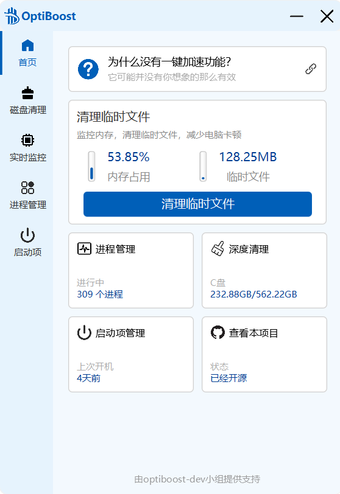
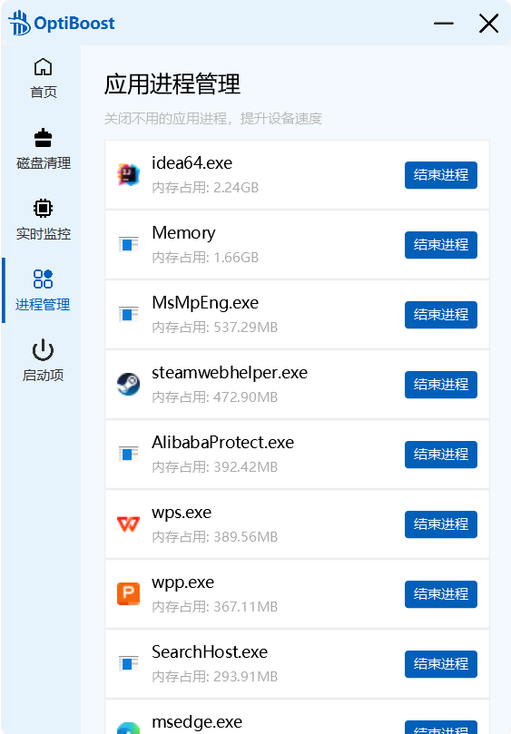
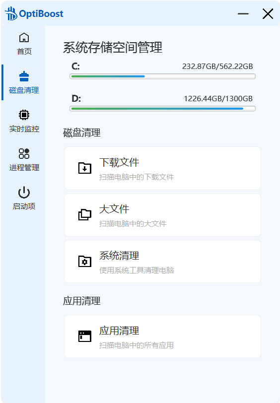
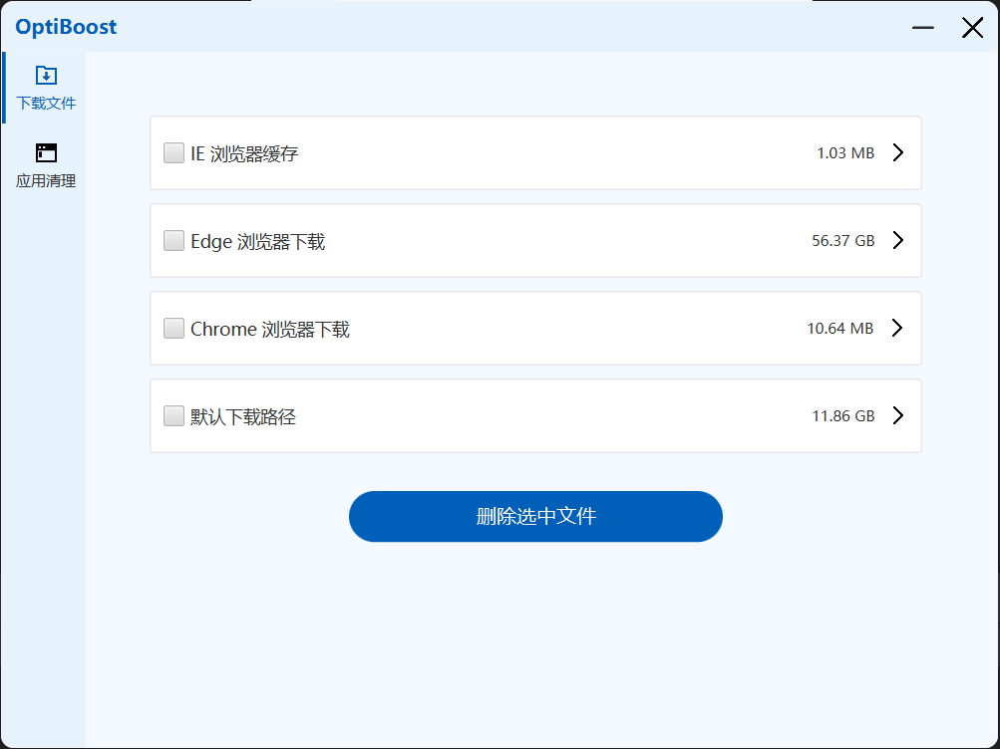
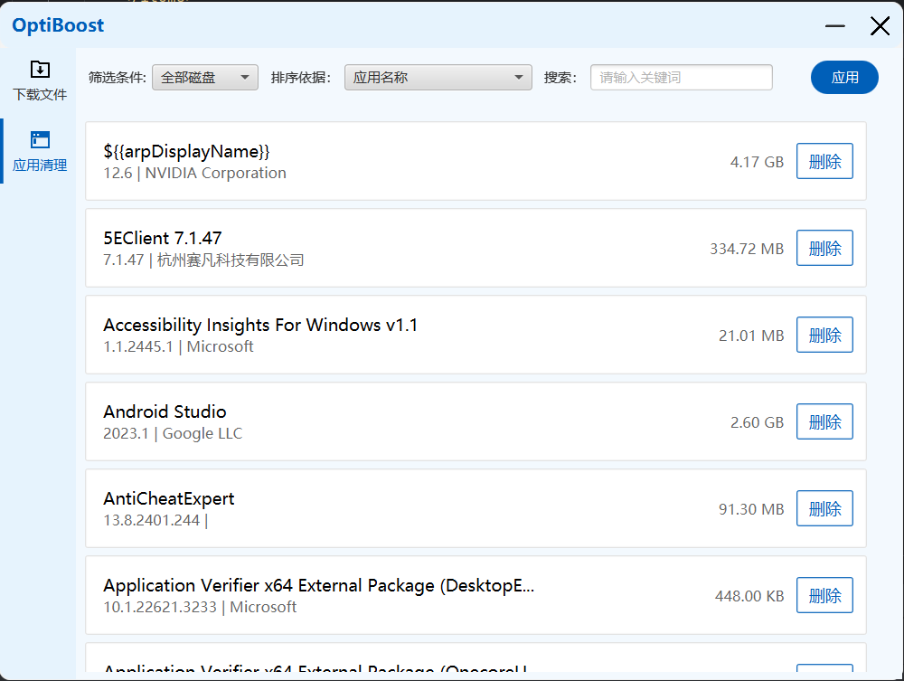
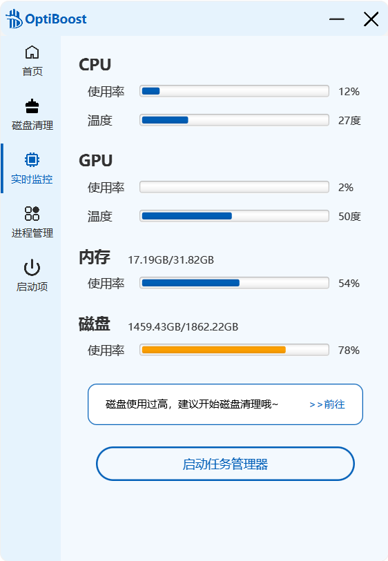
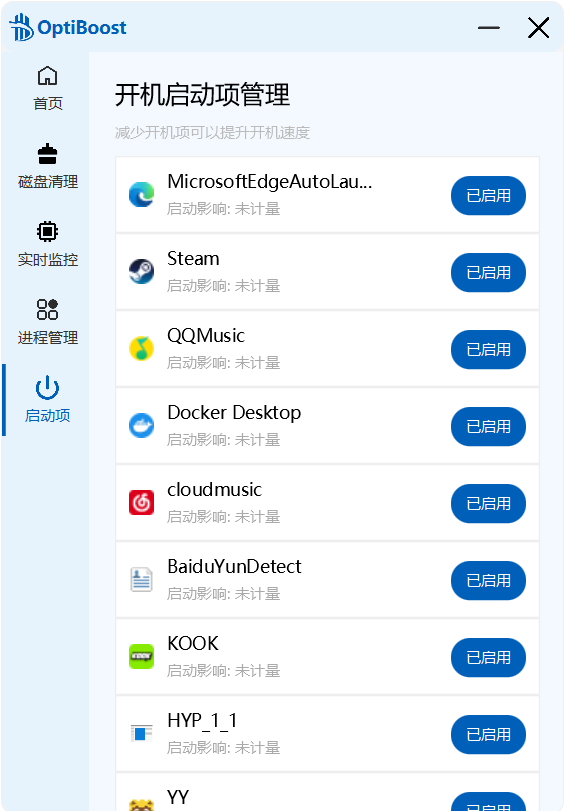

# optiboost

optiboost——操作系统助手

## 启动方式

运行MainApplication即可

## 应用组成

### 首页

首页并没有一键加速功能，关键原因是正常的一键加速其实并没有吧使得电脑变快，而是通过API强制将进程工作集中的内存尽可能多地移动到页面文件中，或者自身大量请求内存来让其他进程释放，当场能看到内存占用降低，但是其实内存会很快回温到原本的水平甚至更高，而且会妨碍软件和电脑的正常运行，因此我们只做了清理临时文件部分，让不再被使用的临时文件得到删除，也能降低一部分内存。

接下来四个按钮，分别代表了进程管理、深度清理、启动项管理以及本项目的github地址，分别可以跳转到对应链接

### 应用进程管理

首页没有一键加速，因此我们做了进程管理，将推荐内存占用前20名的非系统应用来让用户选择是否需要结束进程，若用户选择结束进程，将会继续重新获取。

> [!IMPORTANT]
>
> 为什么选择前20名呢？基于的是一个我们自身的体验，就是大部分影响我们体验的，都来自于大进程，也就是一些游戏、IDE等等，这个栏目可以让用户一眼看出自己是不是忘记关闭了一些进程从而导致的卡顿

### 磁盘清理

磁盘清理的首页面能够看到磁盘的使用情况，然后，在下方有多个选项可以使用，我们将一个一个介绍，首先是系统清理，会使用windows自带的cleanmgr，帮助你清理系统文件和部分缓存残留

下面是我们的下载文件部分，可以看到目前有的四个检测路径：IE、Edge、Chrome和默认下载路径，其余浏览器目前暂未支持，后续更新会考虑加入

这里是我们的应用清理部分，由于需要计算每一个应用的大小，在注册表中并没有存储，因此会比较慢，大概在10s左右，然后上方可以筛选、搜索，完成选择和输入后，点击按钮即可应用，筛选很快，点击删除后会唤起它本身的删除界面。

### 实时监控

在本页面可以清晰地见到CPU、GPU、内存和磁盘的使用情况，帮助用户更好地监控电脑

并且我们还会对占用率较高的栏目给出建议，并引导用户前往对应的部分进行清理

### 启动项管理

在这里我们可以管理开机启动项，通过减少开机启动项来提升我们的开机速度，启动影响部分由于还未想好，因此暂时搁置

