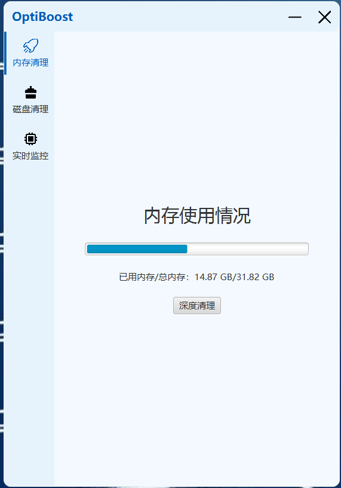
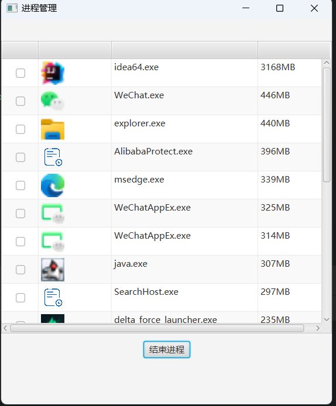

# optiboost

optiboost——操作系统助手

## 启动方式

运行MainApplication即可

## 使用方式

### 内存清理

首页实时显示当前的内存使用情况，点击深度清理将推荐前二十个内存占用最大的进程，由用户自行清理，多线程扫描进程当进程特别多的时候会出现较慢的情况，但是是由于需要读取icon的必要开销

选择需要关闭的进程，点击结束后自己会刷新

> [!WARNING]
>
> 由于时间问题，目前暂未做对于进程的保护，点击结束进程后会直接结束，如果关闭了关键进程可能导致电脑运行出错

### 磁盘清理

磁盘清理的首页面能够看到磁盘的使用情况，然后，在下方有多个选项可以使用，我们将一个一个介绍，首先是系统清理，会使用windows自带的cleanmgr，帮助你清理系统文件和部分缓存残留

下面是我们的下载文件部分，可以看到目前有的四个检测路径：IE、Edge、Chrome和默认下载路径，其余浏览器目前暂未支持，后续更新会考虑加入

这里是我们的应用清理部分，由于需要计算每一个应用的大小，在注册表中并没有存储，因此会比较慢，大概在10s左右，然后上方可以筛选、搜索，完成选择和输入后，点击按钮即可应用，筛选很快，点击删除后会唤起它本身的删除界面。

### 实时监控

在本页面可以清晰地见到CPU、GPU、内存和磁盘的使用情况，帮助用户更好地监控电脑

